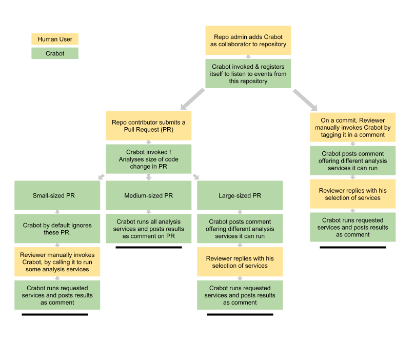

# CRABOT - Code Review Assist Bot

## Use Cases

####Use Case: Get Code-review-stats for new pull-requests (large-sized)

#####1 Preconditions
     Repo owner must have added bot as a collaborator.

#####2 Main Flow
     User will submit a PR to repo [S1]  
     Bot provides list of differnt analysis it can do [S2]  
     Reviewer provides go-ahead for the analysis he/she wants [S3]  
     Bot runs analysis, and posts stats as a comment [S4]

#####3 Subflows
    [S1] User submits PR to repo.
    [S2] Bot will get auto-invoked from web hook, and will return a list of analysis it can run on the code.  
    [S3] User will confirm which analysis to run. 
    [S4] Bot will run requested analysis, and post stats on the GitHub comment thread.

#####4 Alternative Flows
    [E1] User can choose to run all the services offered by crabot by saying @crabot Run all.
    [E2] User can choose not to run any analysis.

--------------------------------------------------

####Use Case: Get Code-review-stats automatically for new pull-requests (medium-sized) 

#####1 Preconditions
     Repo owner must have added bot as a collaborator.  
     We will define medium-size code by an arbitrary SLOC range.

#####2 Main Flow
     User will submit a PR to repo [S1]  
     Bot detects size of PR to be medium, runs analysis automatically and posts stats as a comment [S2]

#####3 Subflows
    [S1] User submits PR to repo.
    [S2] Bot will get auto-invoked from web hook, will run analysis, and post stats on the GitHub comment thread.

#####4 Alternative Flows
    [E1] User can again comment on the thread requesting crabot to run all or some of the services. Eg. @crabot Run Service1, Service2

--------------------------------------------------  

####Use Case: Get Code-review-stats for new pull-requests (small-sized) 

#####1 Preconditions
    Repo owner must have added bot as a collaborator.
    We will define small-size code by an arbitrary SLOC range.

#####2 Main Flow
    User will submit a PR to repo [S1]
    Bot detects size of PR to be small, and so ignores it [S2]   
    User can manually invoke the bot to run specific analysis [S3]
    Bot runs analysis, and posts stats as a comment [S4]

#####3 Subflows
    [S1] User submits PR to repo.
    [S2] Bot will get auto-invoked from web hook, detects small code size, and so ignores it. 
    [S3] User will request different analysis to run.
    [S4] Bot will run requested analysis, and post stats on the GitHub comment thread.

#####4 Alternative Flows
    [E1] User can choose which analysis to run. Eg. @crabot Run Service1, Service2
    [E2] User can choose not to run any analysis.

--------------------------------------------------  

####Use Case: Get Code-review-stats manually for specific commit(s)

#####1 Preconditions
    Repo owner must have added bot as a collaborator. 

#####2 Main Flow
    
    User will choose a commit, and invoke bot [S1]
    Bot provides list of differnt analysis it can do on that commit [S2]
    Reviewer provides go-ahead for the analysis he/she wants [S3]
    Bot runs analysis, and posts stats as a comment [S4]

#####3 Subflows
    [S1] User calls bot on a specific commit, by invoking it via comments.
    [S2] Bot will return a list of analysis it can run on the code. 
    [S3] User will confirm which analysis to run.
    [S4] Bot will run requested analysis, and post stats on the GitHub comment thread.

#####4 Alternative Flows
    [E1] User can choose all or some of the offered services for the bot to run.

## Mocking

Crabot is integrated with Github. Whenever a user submits a Pull Request to the repo, Crabot will be called. Upon getting called on, Crabot will analyze the size of the commit and then based on that provide the user with the different kinds of analysis it can run. Once the user selects his/her choice, Crabot will run the requested services and post the results as a comment. 

This workflow can be understood better by the following Flow Diagram. 

For this milestone, the results that Crabot will post for each service is mocked and in the next milestone Crabot will run the analysis and post actual results. 

## Bot Implementation

#####Bot Platform: 
We are implementing the bot in Python. The bot service written in Flask, runs on an EC2 server.
For interacting with Github, we use the GitHub API using a Python wrapper (PyGithub). 
When Crabot is added as a collaborator in a repo, it is first registered  by subscribing to that repository's events. This subscription is done manually at the moment, but will be automated in the next milestone. 
Github allows a [PubSubHubbub](https://developer.github.com/v3/repos/hooks/#pubsubhubbub) model for web-hooks, which we are using. Once the bot is subscribed to these events (PR submission, comment posting on PR, comment posting on Commit), bot can listen in and respond. 

#####Bot Integration: 

All the conversation with Crabot happen in the comment section of Github. As per Use Case scenario, this can be a Pull Request's comment section, or a Commit's comment section.

## Selenium Testing

Selenium Testing was done for all the Use Cases described above. 

The code for Testing the Use Cases:

+ [Use Case 1 - Large Pull Request] (https://github.ncsu.edu/uverma/crabot/blob/master/Selenium/src/test/java/selenium/tests/PullTestLarge.java)
  
  Happy Case: Bot is invoked automatically and then asks the user for any specific service to run.
  
  Alternate Case: Bot is invoked automatically and then runs all the services. 

+ [Use Case 2 - Medium Pull Request] (https://github.ncsu.edu/uverma/crabot/blob/master/Selenium/src/test/java/selenium/tests/PullTestMedium.java)
  
  Happy Case: Bot is invoked automatically and then runs all the services. 
  
  Alternate Case: Bot is invoked by the user and the user asks for the specific services to run. 

+ [Use Case 3 - Small Pull Request] (https://github.ncsu.edu/uverma/crabot/blob/master/Selenium/src/test/java/selenium/tests/PullTestSmall.java)
  
  Happy Case: Bot is invoked automatically and then asks the user whether to run all the services. 
  
  Alternate Case: Bot is invoked automatically and then asks the user for any specific service to run.

+ [Use Case 4 - Specific Commits] (https://github.ncsu.edu/uverma/crabot/blob/master/Selenium/src/test/java/selenium/tests/WebTest.java)
  
  Happy Case: Bot is invoked by the user for the specific commit and the user asks the bot for the specific services to run. 
  
  Alternate Case: N/A

The Screencast for the Selenium Testing is given below.

## Task Tracking

Task Tracking Worksheet: [WORKSHEET] (WORKSHEET.md)

## Screencast

+ [Use Cases] (https://www.youtube.com/watch?v=nbwuwRXdze8&feature=youtu.be)
+ [Selenium Testing] (https://www.youtube.com/watch?v=Jsm0BtOjBTI)

