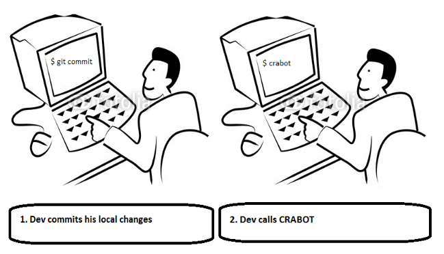
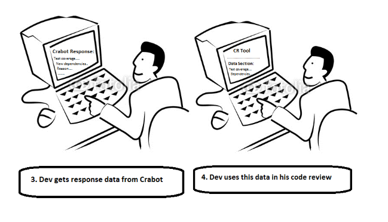
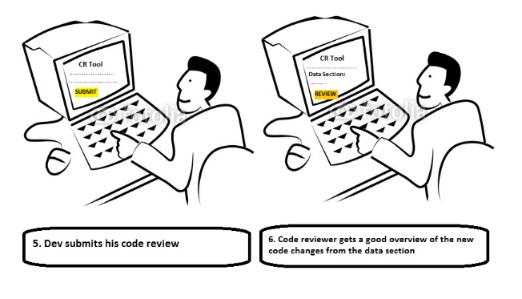
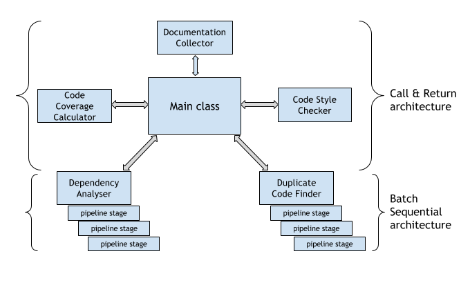

# CRABOT - Code Review Assist Bot

## Problem Statement
Today’s software industry demands agility, flexibility and efficiency. A major timesink for developers are tasks related to code review (CR). When posting code for review, developers typically follow a template, and add information to it - such as a list of changes made, list of new dependencies added with reason, and, test coverage figures. It is also of interest to ensure that the new changes made do not duplicate any existing code and follow good coding styles. Code review is thus a very important part of the software engineering process. However, manually collecting and writing all this information for  CR is a mundane, repetitive, error-prone and cumbersome job. Whether a novice developer or an expert, there is high probability that they overlook some checkpoints, eventually resulting in poor software. 

In every software development lifecycle, a developer needs to document the changes he/she made to the existing code. Building a code needs to take into account the dependencies of several packages. The code is tested and the percentage of code covered in the test cases is also documented. When several programmers collaborate in a project, it is likely that the code written by one may be very similar to what another programmer wrote. Such duplications should be minimal, or none at all. 

In our project, we endeavour to create a bot which will facilitate a software engineer to complete the tasks listed before, saving the developer precious time to devote to other tasks. We hope that using our bot will also reduce the hassles faced by reviewers and reduce errors.

## Bot Description
Crabot evaluates and gathers comprehensive information of recent code commits and aims to help software developers to easily complete documentation-specific fields of a code-review (CR) template. Specifically Crabot will perform the following tasks in an automated manner:

+ Evaluate and report test coverage of newly added code
+ Report newly added code dependencies, and, the reason these dependencies were added
+ Provide documentation of new methods to help a reviewer better understand the new code changes
+ Detect and report duplicate code
+ Provide a brief summary of new code changes

As evident, all the above tasks are repetitive and pre-defined and can be fully automated without any intervention from the developer. This serves as the motivation behind our bot - a developer should not perform the time-consuming and mundane task of gathering information to complete a CR template. Our bot aims to dynamically gather this data in an automated way and present it to the developer on-demand. Since developers now have access to ready information from Crabot, it will help them comprehensively fill all fields of a CR template with less errors. Subsequently, this will help code-reviewers to quickly comprehend the meaning of new code changes. This will lead to a reduction in back and forth communication between reviewers and submitters around the context of new code. Not only will this save the developer’s time and increase his productivity (he now has more time for tasks that matter, like coding), it will also lead to increased efficiency and consistency in the complete CR cycle of a team.

In essence, Crabot may be considered as a combination of code, test and documentation bots. It will run on code commits and autonomously evaluate and report code coverage, code duplication if any, and gather documentation specific reports, all of which will save precious developer time. Crabot will typically run automatically after a set of local git commits. The number on this set will be made configurable to the developer. A developer might use Crabot’s result in this case, to assess his progress in terms of code coverage and code redundancy. Additionally Crabot will also have an option to be invoked explicitly from command line.  This will aid a developer who wants to quickly send his code for review and doesn’t want to spend too much time documenting information in the CR template. Upon being invoked, Crabot will dynamically provide this data to the developer.

## Design Sketches
### Wireframe

### Story-board

## Architecture Design

Our bot design fits best with the Call & Return (C&R) architecture pattern, and with the Main program with Subprogram pattern in specific. It is not a pure C&R architecture though, but is a hybrid, where some subprograms follow a Batch Sequential data flow architecture. The main thread running the bot, calls the subprograms which are independent modules to do different tasks (coverage calculation, duplicate search, and others), and then it compiles all this information returned from each module into a single structured text block.  

Some modules are simple subprograms, and return the information after performing some computation. These are :

+ Code Coverage calculator
+ Documentation accumulator
+ Code Style checker

While, some other subprograms follow the Batch Sequential architecture. These are:

+ Duplicate Code finder : this has several sequential steps
	+ Build a syntax tree or other required code analysis structures
	+ Analyse the structures, and find similar code patterns
	+ (optional) if possible, suggest to fix this duplication
	+ (optional) fix any spelling mistakes in code-comments
	+ Return results/Return a code-commit (for fixes)
+ Dependency analyser
	+ Find any new dependencies which were added (diff on dependency file)
	+ (optional) look for context where the new dependencies are used in code
	+ Report results

The different subprograms are independent, and can be run parallely in different threads. This architectural design also grants us flexibility to add more features by simply adding more subprograms in the future.
The bot will need access to the code before it has been pushed to mainline, and thus, we intend it to run locally on the developer’s machine. The bot can be triggered on post-commit hook, and can smartly decide if it should run analysis or not (eg: if it is a very small commit, it can decide not to run the analysis). When it does run, after the analysis is done, it posts results to a text file in the same directory. After this, the developer can use this text for use in code-reviews, and later, in release-notes. 
 We plan to use 3rd party tools where possible, like [JaCoCo][link_jacoco] for code-coverage,  and, [GumTree][link_gumtree] for code-duplicates search.

[link_gumtree]:https://github.com/GumTreeDiff/gumtree
[link_jacoco]:http://www.eclemma.org/index.html