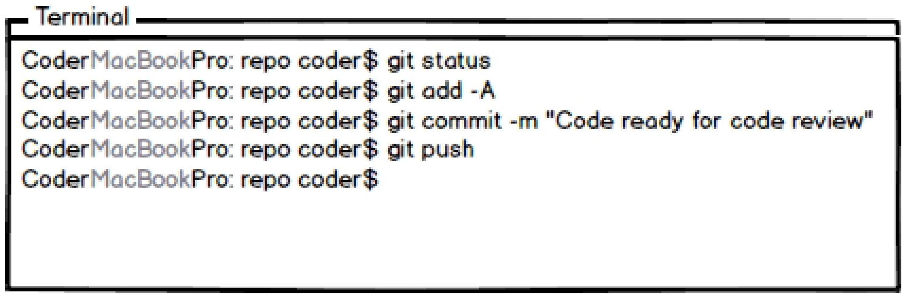

# CRABOT - Code Review Assist Bot

## Problem Statement
Today a major timesink for developers are tasks related to code review (CR). When posting code for review, developers typically follow a template, and add information to it - such as a list of changes made, list of new dependencies added along with reason, and, test coverage figures. It's also of interest to ensure that the new changes made do not duplicate any existing code and follow good coding styles. Proper code review is, thus, an essential part of the software engineering process. However, manually collecting and writing a lot of this information for CR is a mundane, and repetitive task quite prone to errors. It is a job very much suitable for automation with a bot. 

In this project, we try to create such a bot which will facilitate a software developer in this task, saving the developer precious time to devote to other tasks. We hope that using our bot will make the life of developers and code reviewers easier, by providing succint information useful for quick evaluation.

## Bot Description
Our bot (Crabot) takes code submitted for PR (pull request), runs different analysis and posts results to help software developers to easily review the code. Specifically Crabot will perform the following tasks:

+ Evaluate and report test coverage of newly added code
+ Report newly added code dependencies
+ Extract documentation of new methods to help a reviewer better understand the new code changes
+ Detect and report any duplicate code

As evident, all the above tasks are repetitive and can be pre-defined for automation without any intervention from the developer. This serves as the motivation behind our bot. It will dynamically gather this data and present it to the developer. Subsequently, this will help code-reviewers to quickly comprehend the meaning of new code changes. This can lead to a reduction in back and forth communication between reviewers and submitters around the context of new code. Not only will this save the developer’s time and increase his productivity (he now has more time for tasks that matter, like coding), it will also lead to increased efficiency and consistency in the complete CR cycle of a team.

In essence, Crabot may be considered as a combination of code, test and documentation bots. A code reviewer/repository owner might use Crabot’s results in evaluation, before he is satisfied with it and merges it with mainline. 

## Design Sketches
### Wireframe

### Story-board

 

## Architecture Design

The interaction with our bot is supposed to happen on the GitHub platform. It will be like just another user you can tag in your comments on GitHub to invoke it explicity. By default, it will be triggered on a pull request being submitted. The bot will run on a cloud-hosted server like Amazon EC2. The submitted code will be fetched by it, analysis done, and the results will be posted by it as a comment on that PR.

The bot's architecture fits best with the Call & Return (C&R) architecture pattern, and with the Main program with Subprogram pattern in specific. It is not a pure C&R architecture though, but is a hybrid, where some subprograms follow a Batch Sequential data flow architecture. The main thread running the bot, calls the subprograms which are independent modules to do different tasks (coverage calculation, duplicate search, and others), and then it compiles all this information returned from each module into a single structured text block.  

Crabot's design also belongs to repository model, the data is being posted at a common platform i,e github repository page. It uses a push model: crabot, reviewer and deveopper can write data and is being read by the components involved.

Some modules are simple subprograms, and return the information after performing some computation. These are :

+ Code Coverage calculator
+ Documentation accumulator
+ Code Style checker

While, some other subprograms follow the Batch Sequential architecture. These are:

+ Duplicate Code finder : this has several sequential steps
	+ Build a syntax tree or other required code analysis structures
	+ Analyse the structures, and find similar code patterns
	+ (optional) if possible, suggest to fix this duplication
	+ (optional) fix any spelling mistakes in code-comments
	+ Return results/Return a code-commit (for fixes)
+ Dependency analyser
	+ Find any new dependencies which were added (diff on dependency file)
	+ (optional) look for context where the new dependencies are used in code
	+ Report results

The different subprograms are independent, and can be run parallely in different threads. This architectural design also grants us flexibility to add more features by simply adding more subprograms in the future.
Bot can smartly decide if it should run analysis or not (eg: if it is a very small commit, it can decide not to run the analysis). We also plan to use 3rd party tools where possible, for example [JaCoCo][link_jacoco] for code-coverage analysis, and, [GumTree][link_gumtree] for code-duplicates search.

## Additional Patterns
Crabot's architecture also belongs to event systems as it involves both explicit and implict invocations. Based on thresholds set on different parameters, bot will have an implicit invocation when a pull request is made. And if the thresholds are not met then the bot can also be explicitly called by tagging the bot like any other user. 

[link_gumtree]:https://github.com/GumTreeDiff/gumtree
[link_jacoco]:http://www.eclemma.org/index.html
